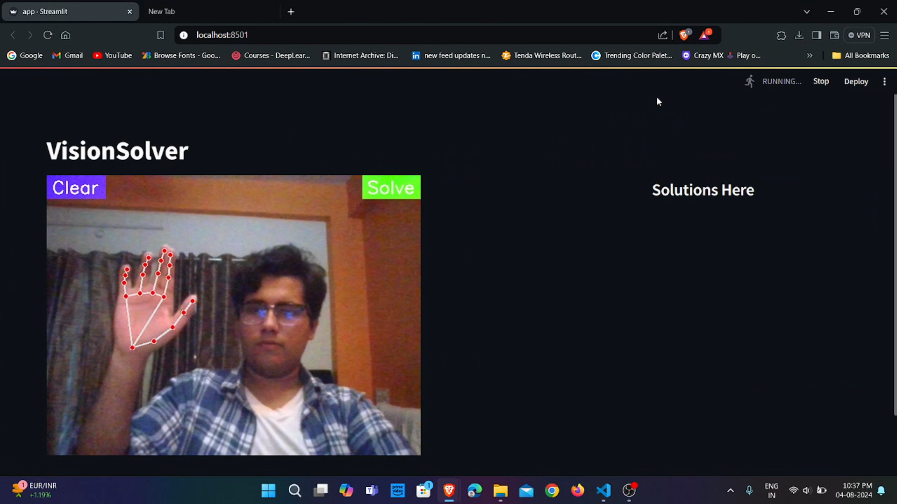
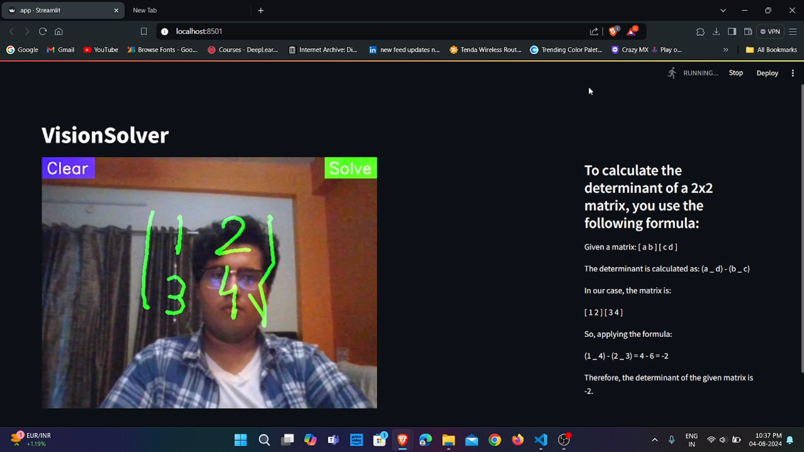
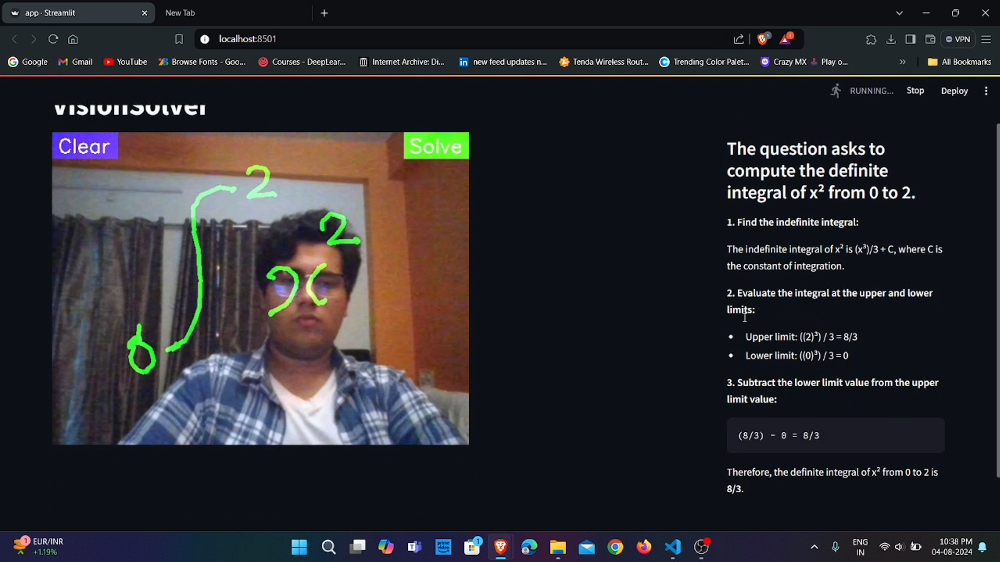

# VisionSolver

## Description

VisionSolver is an innovative project designed to solve complex vision-related tasks. Utilizing a combination of advanced technologies, this project provides a user-friendly interface for image recognition, object detection, and more. The project supports the following key functionalities:

-   **Streamlit Interface**: A seamless web interface for easy interaction.
-   **OpenCV Processing**: Robust image processing capabilities.
-   **Gemini Vision API**: Advanced vision capabilities through the Gemini Vision API.

## Tech Stack

-   **Streamlit**: For building and sharing data apps.
-   **OpenCV**: For image and video processing.
-   **Gemini Vision API**: For advanced vision processing tasks.

## Features

-   **Image Recognition**: Identify objects and scenes in images.
-   **Object Detection**: Detect and highlight objects within an image.
-   **Real-time Processing**: Process video feeds in real-time for immediate results.
-   **User-Friendly Interface**: Simple and intuitive interface powered by Streamlit.

## Installation

1. Clone this repository:

    ```bash
    git clone https://github.com/ChaitanayaK/VisionSolver
    cd visionsolver
    ```

2. Install the required dependencies:
   To set up a virtual environment and install the required dependencies from a `requirements.txt` file, follow these steps:

    1. **Create a virtual environment:**

        - **On Windows:**

            ```bash
            python -m venv venv
            ```

        - **On macOS/Linux:**
            ```bash
            python3 -m venv venv
            ```

        This will create a virtual environment in a directory named `venv`.

    2. **Activate the virtual environment:**

        - **On Windows:**

            ```bash
            venv\Scripts\activate
            ```

        - **On macOS/Linux:**
            ```bash
            source venv/bin/activate
            ```

        After activation, your command prompt should show `(venv)` indicating that the virtual environment is active.

    3. **Install the required packages from `requirements.txt`:**
        ```bash
        pip install -r requirements.txt
        ```

    These steps will set up the virtual environment and install all the necessary dependencies for VisionSolver.

## Usage

1. **Run the Application**:

    ```bash
    streamlit run app.py
    ```

2. **Features**:
    - **Image Recognition**: Upload an image to identify objects and scenes.
    - **Object Detection**: Upload an image to detect and highlight objects.
    - **Real-time Processing**: Use a video feed for real-time image processing.

## Screenshots

1. 
2. 
3. 
4. 

## Video Demo

Watch the demo of the application here: [VisionSolver Demo](demo-video/vision-solver.mp4)

## Contributing

Feel free to contribute to this project by submitting issues or pull requests. For major changes, please open an issue first to discuss what you would like to change.

## License

This project is licensed under the MIT License - see the [LICENSE](LICENSE) file for details.

## Acknowledgments

-   Thanks to the creators of Streamlit, OpenCV, and Gemini Vision API for providing the tools used in this project.
-   Special thanks to the open-source community for the inspiration and support.
